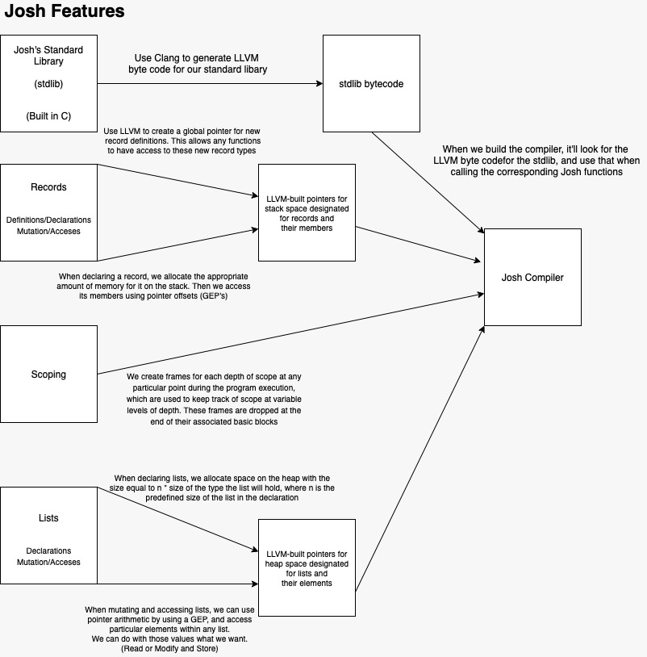
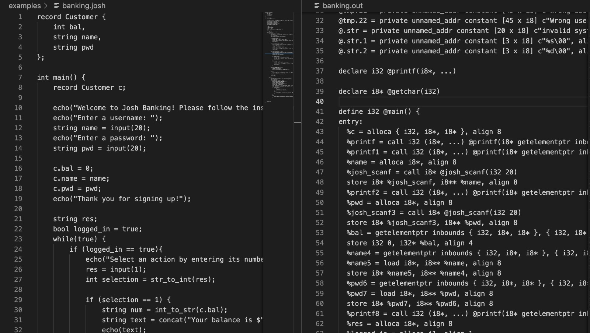

# Introduction
Josh is your friendly neighborhood language that can run bash scripts.
Scripting is a very important skill that every programmer needs in order to
automate tests. Yet, getting familiar with scripting languages such as bash
needs time - which is exactly where Josh comes in. Josh focuses on education,
and it is designed for beginner to intermediate level programmers to
familiarize themselves with bash and UNIX command-line. Josh is not intended
for general-purpose use or for complex systems. 
 
Josh has C-like syntax and a subset of C capabilities (such as creating custom
types, function calls) in order to present the programmer with a more familiar
and readable programming environment. Aside from being able to perform basic
programs in a similar way to C, the standard library includes a bash function
which enables the programmers to interact with the UNIX command line in the
program. Unlike C, the bash function enables to add bash scripts to various
locations of the program (for example within different functions) and provides
an abstraction from the system calls that perform the operation (fork, execl,
etc.) for the ease of the programmers. 

Josh is statically scoped and strongly typed. This feature allows you to use
type checking prior to running scripts for safety to avoid cluttering state if
a part of the program is not valid and cut run-time errors. 

Unlike bash or other scripting languages, Josh is less complex and built for
readability and reusability through C-like syntax. It is an intermediary
educational language that aims to allow programmers to transition to bash from
C. Through readable and reusable code with easier syntax, Josh minimizes error
and expedites automation for routine tasks and testing.

# Language Tutorial
## Instructions for building Josh
### Build Josh Compiler

1. Build standard library (`liberate_josh.bc` from `liberate_josh.c`)
   ```
   clang -c -pthread -emit-llvm lib_josh.c
   ```
2. Build josh.native and link standard library
    ```
    ocamlbuild -pkgs llvm,llvm.bitreader,llvm.linker josh.native
    ```

### Compile and Run a Program
```
./josh.native -l simple.josh > simple.out
```

### Run LLVM
```
lli simple.out
```

## Types, Expressions, Statements, and Standard Library
The following part of the document is dedicated to providing an overview of
Josh syntax and focuses specifically on the different parts from the C-syntax.

### General Structure:
A Josh program consists of top-level functions, record definitions, and global
variable declarations. Top-level statements other than variable declarations is
undefined behavior.

The entry point of the program is the main function (defined as main), which
returns 0 on success. There are no nested functions. Global variables
accessible through all points of the program. The separators are used as
follows throughout the program:

#### Separators:

- Commas delimit arguments and record fields.
- Semicolons delimit statements.
- Parentheses are used to group expressions and call functions.
- Braces are used to group blocks and construct records.
- Brackets are used to construct and index lists.
- Dots are used to access record fields and write literal floats.

### Comments:
Josh supports single line and block comments (no nested comments) which start
with the character sequence `{|` and end with `|}`. Comments are discarded by the
scanner.

### Types:
Josh provides support for 5 primitive types: int, float, bool, char, and
string,
and 2 non-primitive types: lists and records.

Josh supports declaration, assignment, initialization, access, and mutation of
lists. Lists in Josh are implemented as arrays thus they require the number of
elements of the array to be specified.

```
{| declaration |}
int[3] mylist;

{| assignment |}
mylist = [1, 2, 3];

{| initialization |}
char[2] mylist2 = ['a', 'b'];

{| access |}
int x = mylist[2];

{| mutation |}
mylist2[0] = ['c'];
```

As non-primitive types, records are analogous to structs in C. Josh supports
defining records globally outside the main method and declaration, assignment,
initialization, access, and mutation of records. It is not possible to declare
records inside functions.

```
{| definition, outside main |}
record Person = {
    string name,
    int age
};

{| in main ... |}
{| declaration |}
record Person jane;

{| assignment |}
jane = Person { "Jane", 21 };

{| initialization |}
record Person josh = Person { "Josh", 21 };

{| access |}
string name = josh.name;

{| mutation |}
jane.age = 35;
```

### Expressions:
Josh supports the following expressions: expressions with parentheses around
them, basic binary operators (arithmetic: `+`, `-`, `*`, `/`, `%`; comparison: `==`, `>`, `<`,
`>=`, `<=`; logical: `and`, `or`), unary operator (`not`), and assignment using `=`, and
function calls. Record/list mutation and access are also considered expressions
and work as described above.

```
{| arithmetic expression |}
int a = 10 * 5;
int b = 10 % 2;

{| function call |}
foo(a, b);
```

### Statements:

Expressions, variable declarations, if/else statements, for loops, while loops,
return statements, and function declarations are supported in Josh. The syntax
for all of the statements are identical to C. Josh also allows nested
statements.

#### Function Declarations:
The syntax for function declarations are identical C. Functions allow for one
return type, and the declaration starts with the return type of the function,
followed by the name of the function, followed by the types/parameters of the
function within parentheses, followed by the body of the function within
braces. All parameters are passed by value.

```
{| function declaration |}
int foo (int a, int b) {
...
}
```

### Standard Library:

I/O functions: `echo`, `echoi`, `scanf`

Scripting: `bash` (executes the bash command given as an input)

Casting: `int_to_float`, `float_to_int`, `str_to_int`, `int_to_str`

Math functions: `sqrt`, `pow`

String functions: `strcmp`, `concat`, `subset`, `get_char`

# Architectural Design

## Overview of Josh IR generation


## Scanner
scanner.mll parses an input file containing Josh source code and returns a
sequence of tokens. The scanner generates these tokens according to the syntax
rules of Josh, which dictate which sequences of characters correspond to a
valid Josh token. White space and comments are filtered-out. If any sequences
of characters cannot be classified as a valid token, the scanner throws an
error.

The afore-mentioned generated tokens are passed to the parser in the part of front-end compilation.

## Parser
parser.mly takes input from the scanner. It outputs an abstract syntax tree
(AST). That AST is used by semantics in the next phase of compilation. The
parser was implemented to syntactically follow the model of the Josh language,
which can be represented as a context-free grammar. Should the input of tokens
not represent a valid program (e.g. else without if), the parser raises a
failure.

## Semantics
In the next phase of compilation (semant.ml) the types defined in the ast.ml
and sast.ml are utilized to return a semantically checked abstract syntax tree
(SAST). The SAST has the same structure as the abstract syntax tree, but each
node also has a type. This phase of compilation checks that the inputted
program is consistent with Josh’s strongly typed system, and static scoping.
Additionally, it makes sure that operators are only used on expressions with
the correct type. For example, the addition operation only works with integers
and floats, and assignments with mismatching types are considered invalid and
rejected. Function definitions are checked to ensure that the formal return
type matches the type of the actual returned expression. Additionally, should a
function call have arguments that are inconsistent with the formal definition
of the function (either in number or in type) semant.ml will raise an error.
Records are handled in a similar manner.

Scope is also checked through the use of StringMaps: starting with global
declarations, variables are added to the stringmap. Upon entering a further
nested scope, the stringmap is expanded with the declarations in the new scope.
Exiting from scope also means dropping the version of the stringmap that
contained local declarations. Should an expression contain a variable that is
not defined in the stringmap, an error will be raised.

## IR Code Generation
For code generation (implemented in codegen.ml) the SAST typed input from
semantics is used to produce the IR, through extensive use of the OCaml LLVM
module. It traverses the tree and translates each node into LLVM code to build
an LLVM module. The translate function takes in the SAST (a list of top-level
nodes) and returns the LLVM module.

The top-level nodes consist of global variable declarations, function
definitions, and record definitions in any order. All record definitions,
function definitions, and global variables are built before any function bodies
are built. The translate function iterates over all the function bodies and
builds them; this is the last step performed before returning the LLVM module.
This way, every statement in the body of a function has access to global
definitions. Scope has a major role in achieving this.

### Scope and `build_function_body`
Every function body is treated as a statement block, meaning statements are
evaluated in order by `build_stmt` using a `List.fold_left` over the list of
statements, accumulating a tuple containing the LLVM builder and the current
environment of variable declarations. The expressions making up a statement are
built by the function `build_expr`, which also uses the builder and environment.
An environment is an OCaml list of StringMaps (“frames”), with the head
representing the “most local” or deepest scope frame, and successive elements
making up a stack of frames, all the way up to the “formals” (parameters passed
to functions, which are built before evaluating any statements in the function
body) and “globals” (global variables). When the value of a variable is sought
by its identifier, we look through the list of frames until we either find it
or we reach the end of the list, meaning it has not been declared and an error
is thrown.

## While, for, and if
Some statements inside functions include the usual imperative control flow
structures: while, for, and if. These are syntactically identical to C, and as
such we allow for nested control flow. This is achieved by returning a pointer
to the end of the `while_end` or `if_end` basic blocks. Since statements are
evaluated in order while accumulating the builder, this ensures we can have
nested structures.

## Records
Record definitions were a particularly interesting implementation of our
language. We look for record definitions at the `top_level` and put them in a
list called `record_defs`, and then declare a global `struct_type` in the LLVM
module with the name of the record type, its formals, and its constituent
types. These global definitions are then used for record creation, access, and
mutation later on. When an instance of a record is declared, it is allocated on
the stack. The precise amount of memory needed for its allocation is calculated
by considering the sizes of its constituent types. When accessing member
fields, we need to get the correct offset into the record object which is
allocated on the stack. To do this, we calculate the index of the field in the
list of formals and the types of the fields before it, and then call the LLVM
module function `build_struct_gep` to access it.

## Lists
Lists are like the counterpart to records in that they are not globally
defined, nor are they stack-allocated. Lists can have dynamic size, i.e. size
which depends on values computed at runtime. This means it is necessary to
allocate them on the heap using `build_array_malloc`. This is done in two places:
when a literal list is part of an expression, and when a new list is declared
or instantiated. In both cases, we calculate the type of its elements and the
number of elements (given either as the type of the list or by inspecting the
elements in a list literal) and then allocate space on the heap. The pointer is
returned as its address. If declaring a new list, we also make space on the
stack to store this pointer to the heap. When we assign a new literal value to
a list, we make sure we are not wasting memory by freeing the heap memory
currently pointed to. List literals, list mutation, and list access make use of
`build_gep` to get the elements of the list given the list pointer and an index
which is an expression; the former two also store a new value in this location.

If we were to work more on the language, we would add “smart allocation” which
determines whether it is possible to allocate the list on the stack or the heap
depending on how it is used and defined.


# Testing
We wrote our custom shell script for automated testing. This script runs each
program that has a `.josh` extension in the `tests/` directory. The files with the
prefix `test-` in their name are the test cases where a successful result is
expected, while those starting with `fail-` indicate expected failures.

The expected output for each case is provided in separate files within the same
directory. Running `./run_tests.sh` from the root path runs all the tests and
displays the output in the terminal where each test is marked with PASS or
FAIL. Using this testing tool, we were able to quickly identify bugs and areas
of improvement throughout the development process.

In addition to automated tests, we manually inspected the llvm output to ensure
that the generated machine code corresponds to what we learned in class. Our
tests cover basic functionality as well as more complex cases; some selected
programs are also featured in the `examples/` directory.

## Automated Tests Output
```
---Running Tests for Josh---
1. fail-echo: PASS
2. fail-function-call: PASS
3. test-add: PASS
4. test-assign-if-bool: PASS
5. test-assign-primitive: PASS
...
```

## Source Programs and Generated Code
### Example 1: function call, recursion
#### Josh source:
```
int gcd(int a, int b) {
    if (b == 0) {
        return a;
    }
    return gcd(b,a%b);
}

int main() {
    int a = 20;
    int b = 15;
    echoi(gcd(a,b));
    return 0;
}
```

#### LLVM output (selection):
```
define i32 @gcd(i32 %a, i32 %b) {
entry:
  %a1 = alloca i32, align 4
  store i32 %a, i32* %a1, align 4
  %b2 = alloca i32, align 4
  store i32 %b, i32* %b2, align 4
  %b3 = load i32, i32* %b2, align 4
  %tmp = icmp eq i32 %b3, 0
  br i1 %tmp, label %then, label %else

then:                                             ; preds = %entry
  %a4 = load i32, i32* %a1, align 4
  ret i32 %a4

else:                                             ; preds = %entry
  br label %if_end

if_end:                                           ; preds = %else
  %a5 = load i32, i32* %a1, align 4
  %b6 = load i32, i32* %b2, align 4
  %tmp7 = srem i32 %a5, %b6
  %b8 = load i32, i32* %b2, align 4
  %gcd_result = call i32 @gcd(i32 %b8, i32 %tmp7)
  ret i32 %gcd_result
}
```

### Example 2: records, input/output, while, if


### Example 3: list
#### Josh source:
```
int main() {
    string[5] students;
    students[0] = "Angel";
    students[1] = "Bora";
    students[2] = "Burcu";
    students[3] = "Gregory";
    students[4] = "Vas";

    students[3] = "Greg";

    int i;
    while (i<5) {
        echo(students[i]);
        i = i+1;
    }

    return 0;
}
```

#### LLVM output (selection):
```
define i32 @main() {
entry:
  %students = alloca i8**, align 8
  %malloccall = tail call i8* @malloc(i32 mul (i32 ptrtoint (i8** getelementptr (i8*, i8** null, i32 1) to i32), i32 5))
  %tmp = bitcast i8* %malloccall to i8**
  store i8** %tmp, i8*** %students, align 8
  %students1 = load i8**, i8*** %students, align 8
  %tmp2 = getelementptr inbounds i8*, i8** %students1, i32 0
  store i8* getelementptr inbounds ([6 x i8], [6 x i8]* @tmp, i32 0, i32 0), i8** %tmp2, align 8
  %students3 = load i8**, i8*** %students, align 8
  %tmp4 = getelementptr inbounds i8*, i8** %students3, i32 1
  store i8* getelementptr inbounds ([5 x i8], [5 x i8]* @tmp.3, i32 0, i32 0), i8** %tmp4, align 8
  %students5 = load i8**, i8*** %students, align 8
  %tmp6 = getelementptr inbounds i8*, i8** %students5, i32 2
  store i8* getelementptr inbounds ([6 x i8], [6 x i8]* @tmp.4, i32 0, i32 0), i8** %tmp6, align 8
  %students7 = load i8**, i8*** %students, align 8
  %tmp8 = getelementptr inbounds i8*, i8** %students7, i32 3
  store i8* getelementptr inbounds ([8 x i8], [8 x i8]* @tmp.5, i32 0, i32 0), i8** %tmp8, align 8
  %students9 = load i8**, i8*** %students, align 8
  %tmp10 = getelementptr inbounds i8*, i8** %students9, i32 4
  store i8* getelementptr inbounds ([4 x i8], [4 x i8]* @tmp.6, i32 0, i32 0), i8** %tmp10, align 8
  %students11 = load i8**, i8*** %students, align 8
  %tmp12 = getelementptr inbounds i8*, i8** %students11, i32 3
  store i8* getelementptr inbounds ([5 x i8], [5 x i8]* @tmp.7, i32 0, i32 0), i8** %tmp12, align 8
  %i = alloca i32, align 4
  br label %while

while:                                            ; preds = %while_body, %entry
  %i13 = load i32, i32* %i, align 4
  %tmp14 = icmp slt i32 %i13, 5
  br i1 %tmp14, label %while_body, label %while_end

while_body:                                       ; preds = %while
  %students15 = load i8**, i8*** %students, align 8
  %i16 = load i32, i32* %i, align 4
  %tmp17 = getelementptr inbounds i8*, i8** %students15, i32 %i16
  %tmp18 = load i8*, i8** %tmp17, align 8
  %printf = call i32 (i8*, ...) @printf(i8* getelementptr inbounds ([4 x i8], [4 x i8]* @fmt.1, i32 0, i32 0), i8* %tmp18)
  %i19 = load i32, i32* %i, align 4
  %tmp20 = add i32 %i19, 1
  store i32 %tmp20, i32* %i, align 4
  br label %while

while_end:                                        ; preds = %while
  ret i32 0
}
```


# Summary
Angel, Greg, Burcu, Vassilis worked on implementing all of the language
components together (scanner, parser, ast, sast, semant, irgen). Angel focused
specifically on records; Greg on lists, scope, and statements; Vassilis on
standard library and records; and Burcu on scope and team organization. Bora
worked on writing and automating the tests.

## Takeaways:

### Burcu
This project helped me understand all of the steps involved in how a
program written in various languages gets translated into machine code. It
allowed me to understand the importance of the concept of a basic block. When
implementing irgen.ml (especially when focusing on writing nested statements),
I was able to understand how basic blocks and terminals interact with each
other. This project also helped me see the difference between dynamic and
static scoping on a different level as we used a list of StringMaps and
iterated over them in the order of scope in order to find/assign variables. My
advice for teams would be to communicate all parts of the project with the team
so that everything is coherent. Also, being able to work together with my
teammates to debug has helped me learn a lot in terms of how to do a big coding
project as part of a team.

### Vassilis
Designing and implementing our own language with OCaml helped me
appreciate functional programming, particularly while working on the parser and
semantics. On the other hand, irgen put my understanding of low-level memory
management and assembly code to the test. A large chunk of the code was either
straightforward, or implemented in the micro-C code, which was reviewed in
class. The true difficulty is evident when implementing your own ideas as
features of the language. You must have a thorough understanding of computer
architecture and memory, and even still you will be challenged by the
implementation. Since LLVM handles the tedious tasks in code generation, the
team was able to focus on the conceptual and structural difficulties of
implementing a language. An example of this would be the difficulties of
ordering statements around conditional branches and jumps, and handling
pointers when allocating structs/vars on the heap, and pointers to it on the
stack.

### Greg
This was the largest programming project I’ve done so far. I learned a
ton from my teammates who are more experienced than me, and pair-programming
with them to implement features and solve problems was extremely beneficial
both for the project and my personal edification. In particular I spent many
afternoons and evenings working side-by-side with Burcu and Vassilis, each of
our skills complementing each other: Burcu’s design-level thinking and
low-level assembly expertise, Vassilis’s eye for debugging, and my comfort with
functional programming and my previous experience with writing interpreters. In
terms of technical takeaways, I enjoyed working with LLVM because it afforded
us to work at the low level of assembly code while retaining some level of
abstraction–it reminded me of MIPS in Fundies. I came to appreciate the
broadly-scoped thinking that is necessary to implement language features in a
sensible, well-structured way. There were many times I was implementing a
feature in semantics or IR generation and realized that we had to make changes
ranging as far back as the lexer and parser. Hence, foresight and experience
are invaluable for such a large and complex project. Overall, I am proud of how
we dealt with these obstacles and fearlessly went ahead achieving many very
technically-involved features like arrays, records, and nested scope.

### Bora
I gained a much deeper understanding of scripting with bash while
automating the tests. It was very interesting to code many sample programs in a
language created by us (meaning I could not rely on stackoverflow when the
program just does not run...) I also realized the importance of having clear
error messages. Even though our team did a great job of covering a wide range
of failure scenarios, it was sometimes difficult to trace a parsing error or
irgen failure. If we had more time, I think we would improve on error handling
by adding custom exceptions. My advice to future teams is to keep error
messages concise so that it is much easier to trace what went wrong.

### Angel
Working on this project really cleared up my curiosity about programming
languages. Before this, I didn’t even know where to start, but working on Josh
really made it clear what steps had to be done to get a language executing.
There are a lot of problems that I run into while implementing certain
features. For instance, debugging the IR generation code with LLVM was
extremely difficult. And figuring out some of the parser bugs was also really
difficult since there are seemingly many places where errors can arise. But
ultimately, it was a super fun project to work on, and working with a team of
competent developers made it all the more fun.


# References
Harmonica: <https://github.com/jinchengJL/harmonica>

MX: <https://github.com/54aaron/MX>

Viper: <https://github.com/raghavmecheri/viper/tree/main/src>

C-net: <https://github.com/Bruk3/C-net/tree/main>

Micro C implementation done in class
